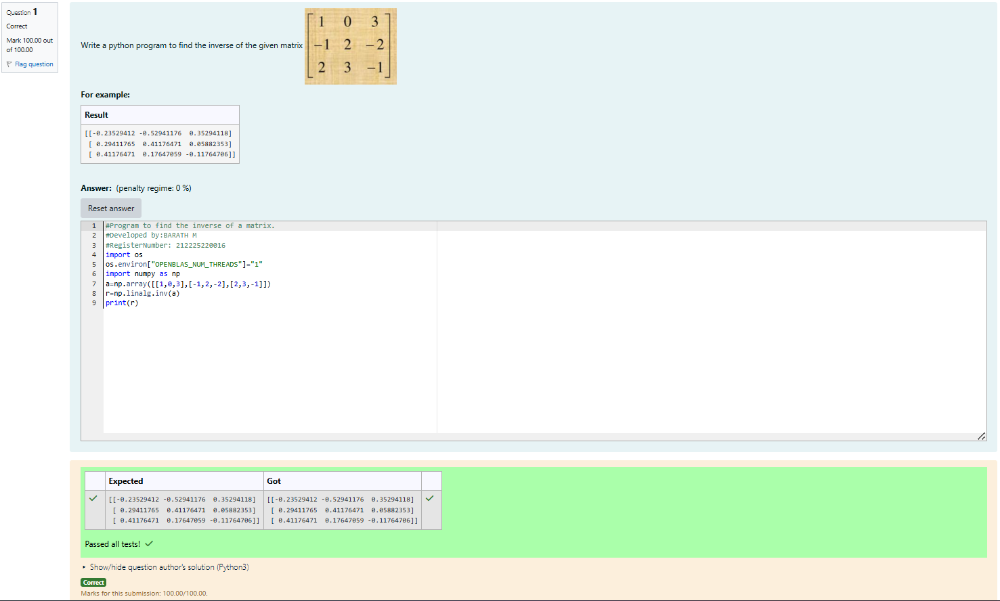

# INVERSE-OF-A-MATRIX
## Aim:
To write a python program to find the inverse of a matrix
## Equipment’s required:
1. 	Hardware – PCs
2. 	Anaconda – Python 3.7 Installation / Moodle-Code Runner
## Algorithm:
### Step1 : Import the NumPy library. 
### Step 2: Define the given matrix using a NumPy array.
### Step 3: Use np.linalg.inv() to find the inverse of the matrix.
### Step 4:Print the inverse of the matrix and end the program. 

## Program:
```
#Program to find the inverse of a matrix.
#Developed by:BARATH M 
#RegisterNumber: 212225220016
import os
os.environ["OPENBLAS_NUM_THREADS"]="1"
import numpy as np
a=np.array([[1,0,3],[-1,2,-2],[2,3,-1]])
r=np.linalg.inv(a)
print(r)
```
## Output:

## Result:
Thus the inverse of given matrix is successfully solved using python program

